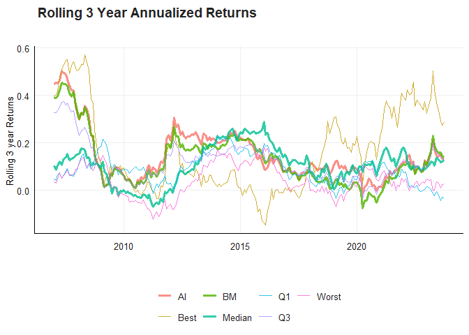
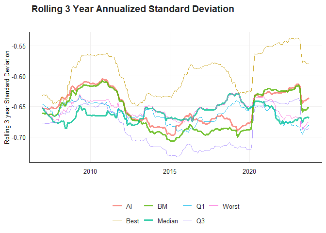

# 22568948 Data Science Practical Exam

In this markdown folder I will explain my thinking and working for the
coding aspect of the Data Science Methods for Economics and Finance
final exam in June 2024. I will work through the questions one by one
and talk through the code that I wrote to complete it.

``` r
rm(list = ls()) # Clean your environment:
gc()
setwd("C:/Users/andre/OneDrive/Documents/Masters_2024_stuff/Data_Science/Data_Science_Exam/22568948")

library(tidyverse)
```

## Packages

What follows is the list of packages that have been used throughout the
functions of this project:

-   tidyverse (includes ggplot2, dplyr)
-   Texevier
-   knitr
-   kableExtra
-   lwgeom
-   sf
-   rnaturalearth
-   rnaturalearthdata
-   ggridges
-   GGally
-   dbbasic

## Question 1

It is firstly important that the working directory of the project is
properly allocated as the directory is used to create folders and
projects. All Texevier lines of code was commented as the projects had
already been created.

``` r
#Firstly I create the Texevier project for writing the report and coding in Question 1
#Texevier::create_template_html(directory = glue::glue("{getwd()}/"), template_name = "Question_1")

#Secondly I fetch the functions that I wrote from the code folder in Question 1
list.files('Question_1/code/', full.names = T, recursive = T) %>% .[grepl('.R', .)] %>% as.list() %>% walk(~source(.))
```

The first command that is run is to create a Texevier HTML project under
the title Question_1 wherein I complete the question. The second is to
fetch the functions that I create while writing the report for question
1.

``` r
Baby_names_df <- Data_Reading("Question_1/data/Baby_Names_By_US_State.rds")
```

This function simply read the data from the given rds file into a
dataframe that can be used in the report. No data transformations take
place in this function.

``` r
plot_corr <- Corr_plot(Baby_names_df)
plot_corr
```



This function transforms the base dataframe to a format that can be used
to plot the Spearman correlation over time. The first step is to rank
the most popular names from each year across the United States. This is
done by grouping by year and name and them summarising to get to get the
totals. Then we arrange the totals in descending order according to the
totals of each name in each year. We can then rank by group to get the
ranking in each year.

Once we have this we can rename the rank variable and mutate the year to
be *no_Years* years earlier (where *no_Years* can be set, default is 3).
We can then left_join the dataframe with the renamed and mutated
dataframe to get the rank of the names in the start year and the later
year. We then arrange by the rank in the start year and use “slice_head”
to get the top *no_top* names per year (where *no_top* can be set, the
default is 25). Correlation is then calculated between the ranks of the
names in the start year and their rank x years later, the Spearman
method is used.

This is then plotted using a geometric line graph to show the changes in
correlation over time, geometric points are added to highlight the exact
points in time and finally a geom_smooth plot is used to show a smoothed
mean across time with a confidence interval of *conf_level* (where
*conf_level* can be set, the default is 0.95).

``` r
plot_ridge <- Ridge_plot(Baby_names_df)
plot_ridge
```



This first step in this function is to take the same base dataframe and
group by name and summarise by count to get the total count of babies
per baby name. Using arrange and head we can get the top *no_names* most
used names (where *no_names* can be set, default is 15).

Then I can group by Year and Name to summarise by count and filter for
the top *no_names* names in each year. I then use the ggridges package
to plot a density ridge plot for the popularity of the most popular
names over time. Using alpha = 0.5 to make the graphs more see through.

## Question 2

This section explains the coding behind question 2 of the exam. The
following code was used to create the project and to fetch the function
to be used in Question 2 from the code folder.

``` r
#Firstly Create the Texevier project
#Texevier::create_template_html(directory = glue::glue("{getwd()}/"), template_name = "Question_2")

#Secondly I fetch the functions that I wrote from the code folder in Question 2
list.files('Question_2/code/', full.names = T, recursive = T) %>% .[grepl('.R', .)] %>% as.list() %>% walk(~source(.))
```

``` r
Musictaste_df <- Inputting_Data(data_root = "Question_2/data/")
```

This function reads the csv files for Metallica and Coldplay and then
combines them by binding their rows.

``` r
Filtered_df <- Data_Filtering(Musictaste_df)
```

This functions alters the base dataframe to a more usable version.
Firstly a variable is created that defines which band plays which songs.
Then differently names album and duration variables are combined
together. Then we filter out all songs that include “Live” or “Edit” in
the title and remove all albums that have “Deluxe”, “Live” or “Remaster”
in the name, I also add back one original song that included “Live” in
the title.

We select the variables we want and scale the relevant musical features
to be on a scale between 0-100, except for tempo.

``` r
plot_box <- Plot_Pop_Box(Filtered_df)
plot_box
```


In the above function I firstly group by album and count the number of
songs. This allows me to filter by albums that have more than *no_songs*
songs (where *no_songs* can be set, default is 1). Secondly I then group
by album and filter according to the albums that have more than
*no_songs* songs. I then plot a box plot for each album, ordering the
x-axis according to release date. A jitter plot is added to show the
individual songs, but with a low alpha and size to not detract from the
box plot.

``` r
plot_hist <- Plot_Histogram(Filtered_df)
plot_hist
```


For this plot I first group by the band and summarise all numeric
columns by mean. I then select the Band and all musical features and
pivot the dataframe to a longer version with the musical features as
rows and the bands as columns. I can then make a grouped bar plot to
compare the musical features for the different bands. I use position =
“dodge” to have spaces between the bar plots and stat = “identity” to
use the values in the dataframe rather than the count() function.

``` r
Supp_df <- Preparing_Supplementary(data_root = "Question_2/data/")
```

This function read in and adapts the supplementary datasets of Spotify
and Billboard to a combined functional dataset. Firstly Spotify is read
in, duration is adapted and variables of interest are selected.

Secondly, the Billboard rds file is read in and filtered to be songs
that achieved a peak rank in a week of 20 or better. We then select
variables of interest and group by song and artist. This allows us to
arrange by date across the groups and keep the last week so that we have
unique entries for each song on their last week in the chart.

Lastly we can join these dataframes together by song and artist, filter
away the Billboard entries that do not have Spotify equals, we summarise
across musical features and mutate the relevant features to again be on
a scale from 0-100. We now have a dataset of the musical features of
popular music.

``` r
Comparison_plot <- Comparing_Features(Filtered_df, Supp_df)
Comparison_plot
```


In this function we firstly rename the relevant variables in the first
dataframe to appropiately leftjoin with the supplementary dataframe and
pivot the table to have the musical features as columns. This allows me
to plot a violin graph for each Band and popular music, which is then
facet wrapped with the different musical features. Y scales are set to
free and alpha is low for interpretability.

## Question 3

``` r
#Firstly Create the Texevier project
#Texevier::create_template_html(directory = glue::glue("{getwd()}/"), template_name = "Question_3")

#Secondly I fetch the functions that I wrote from the code folder in Question 3
list.files('Question_3/code/', full.names = T, recursive = T) %>% .[grepl('.R', .)] %>% as.list() %>% walk(~source(.))
```

The above code fetches the functions from the code folder under question
3.

``` r
read_Data <- Data_Read(data_root = "Question_3/data/")
```

This function reads the ‘Financial Allocations’ and ‘Financial
Commitments’ csv files and then joins them together according to
country.

``` r
Map_df <- Make_Map_Data(read_Data)
```

In order to construct a geographical map of Europe we first create a
dataframe using the ne_countries command from the rnaturalearth package
that returns a dataset of polygons by country. The next step is to
create a second dataframe which contains the data from our Data_Read()
function, we then add a variable that calculates the commitment as a
percentage of GDP.

To combine the dataframes we first mutate the variable containing
country names to be called the same name and deal with one fringe case
where the names for the same countries did not match between dataframes.
We then merge the two dataframes by country names.

``` r
map_plot <- Create_Map(Map_df)
map_plot
```


The Create_Map() function firstly takes the polygons from the merged
dataframe and links them to points on the map, these points are then
changed into coordinates which are placed into the merged dataset. This
data can then be used to plot a ‘simple feature’ graph that is filled
according to the level of commitments. The limits of the coordinates are
set to focus on Europe as the Australian news desk asked for a focus on
Europe.

``` r
table <- Create_Table(read_Data, Markdown = TRUE)
table
```

| Country        | Commitments | Allocations | GDP in 2021 | Difference |
|:---------------|------------:|------------:|------------:|-----------:|
| United States  |  75.4024265 |   0.0022839 | 23315.08056 |  75.400143 |
| Germany        |  43.5377838 |   0.1432366 |  4259.93491 |  43.394547 |
| Denmark        |  11.2931999 |   1.1340074 |   398.30327 |  10.159192 |
| Netherlands    |  10.5792886 |   1.2228751 |  1012.84676 |   9.356414 |
| Japan          |   8.3630170 |   0.5488147 |  4940.87778 |   7.814202 |
| Canada         |   8.2810077 |   0.7764724 |  1988.33633 |   7.504535 |
| France         |  23.1859875 |  15.8355272 |  2957.87976 |   7.350460 |
| Poland         |   7.9081260 |   0.5728865 |   679.44483 |   7.335240 |
| Italy          |  12.9910980 |   6.4517213 |  2107.70284 |   6.539377 |
| Sweden         |   6.5941001 |   0.8514579 |   635.66380 |   5.742642 |
| Cyprus         |   0.1511983 |   1.5029862 |    28.40787 |  -1.351788 |
| Romania        |   1.5116474 |   3.3889639 |   284.08756 |  -1.877317 |
| New Zealand    |   0.0505598 |   2.5841438 |   249.88569 |  -2.533584 |
| Czech Republic |   2.8123711 |   5.5093009 |   281.77789 |  -2.696930 |
| Hungary        |   0.9293242 |   4.0265892 |   181.84802 |  -3.097265 |
| Malta          |   0.0807054 |   5.4945799 |    17.36404 |  -5.413875 |
| Bulgaria       |   0.6564385 |   6.2144780 |    84.05631 |  -5.558039 |
| Turkey         |   0.0721057 |   9.7417417 |   819.03518 |  -9.669636 |
| Estonia        |   1.3236366 |  37.7962519 |    37.19117 | -36.472615 |
| United Kingdom |  17.0196347 |  71.8588265 |  3131.37776 | -54.839192 |

Difference Between Promises and Results

The Create_Table() function takes the initial dataset and firstly
removes missing values, then I calculate the total commitments and
allocations for each country by adding their total individual
commitments/allocations and their commitments/allocations made through
the EU. Then I subtract the total allocations from the total commitments
to calculate the difference in what was promised and what is given.

I then arrange by the difference and filter the values so that only the
extremes on either side shows up. The dataframe is then piped to a kable
function which turns it into a table.

## Question 4

``` r
#Firstly Create the Texevier project
#Texevier::create_template_html(directory = glue::glue("{getwd()}/"), template_name = "Question_4")

#Secondly I fetch the functions that I wrote from the code folder in Question 4
list.files('Question_4/code/', full.names = T, recursive = T) %>% .[grepl('.R', .)] %>% as.list() %>% walk(~source(.))
```

The first chunk fetched the function from where they are stored in the
code folder under Question_4.

``` r
Olympic_df <- Entering_Data("Question_4/data/")
```

The first function (Entering_Data()) reads the data out of their
respective rds files, one for the Summer Olympics, one for the Winter
Olympics and one for the GDP per country. Both Summer and Winter
datasets are appended with a column stating whether it is the Winter or
Summer Olympics. These two are binded together by rows before being left
joined by the GDP dataset by the three letter codes.

``` r
India_plot <- India_Comparison_Plot(data = Olympic_df, data_root = "Question_4/data/")
India_plot
```


For this function it is important that I get to the total amount of
unique medals won by each country. Firstly I filter so that I only have
Summer observations. Then I group by year, event, sport and medal, this
allows me to count by country to get the total amount of medals per
medal event. Then I can group by country and summarise by gold, silver
and bronze medals. This allows me to create a column which is the medal
tally for each country.
*M**e**d**a**l**T**a**l**l**y* = 3 × *G**o**l**d**M**e**d**a**l**s* + 2 × *S**i**l**v**e**r**M**e**d**a**l**s* + 1 × *B**r**o**n**z**e**M**e**d**a**l**s*
I then rejoin the GDP dataset and rank the countries by GDP per capita.

After this I can find the rank of India and filter so that the dataframe
only contains India and the *Range_size* (where *Range_size* can be set,
default is 10) above and below India according to GDP per capita. This
can be piped to a lollipop plot which allows me to analyse the medal
tallies of surrounding countries. Lollipop size is scaled with the
square root of population to account for the exponential differences
across countries.

``` r
stack_plot <- Stacked_Medal_Plot(Olympic_df)
stack_plot
```


In the Stacked_Medal_Plot() function we first alter the operations from
the previous function that returns the medal tally per country so that
it gives the total medal tally in the dataset, we then arrange the
dataset in descending order of medal tally and take the top 9 countries
(excluding the Soviet Union and East Germany).

This is then used to filter the overall dataset by these 9 countries and
plot a stacked line chart between winter and summer Olympics for the
nine most historically successful nations. Facet wrap is used to see the
different countries side by side.

``` r
punching_table <- Create_Table_Punching(Olympic_df, Markdown = TRUE, data_root = "Question_4/data/")
punching_table
```

| Country              | Medal Tally | GDP per Capita | GDP Rank | Medals Rank | Rank Difference |
|:-----------------|----------:|------------:|-------:|----------:|-------------:|
| Ethiopia             |          84 |       619.1694 |      113 |        37.0 |            76.0 |
| Kenya                |         158 |      1376.7128 |      102 |        29.0 |            73.0 |
| Ukraine              |         218 |      2114.9547 |       95 |        24.0 |            71.0 |
| China                |        1002 |      8027.6838 |       62 |         7.0 |            55.0 |
| India                |          50 |      1598.2590 |       99 |        44.0 |            55.0 |
| Russia               |         978 |      9092.5805 |       57 |         9.0 |            48.0 |
| Uganda               |          14 |       705.2926 |      112 |        66.5 |            45.5 |
| Zimbabwe             |          18 |       924.1438 |      108 |        63.0 |            45.0 |
| Egypt                |          52 |      3614.7468 |       87 |        43.0 |            44.0 |
| Indonesia            |          48 |      3346.4870 |       89 |        45.0 |            44.0 |
| Bulgaria             |         406 |      6993.4774 |       63 |        20.0 |            43.0 |
| Uzbekistan           |          38 |      2132.0704 |       94 |        52.0 |            42.0 |
| Gabon                |           2 |      8266.4456 |       60 |       104.0 |           -44.0 |
| Israel               |          10 |     35728.0935 |       23 |        70.0 |           -47.0 |
| Saudi Arabia         |           4 |     20481.7453 |       33 |        88.0 |           -55.0 |
| Mauritius            |           1 |      9252.1107 |       54 |       114.0 |           -60.0 |
| Hong Kong\*          |           6 |     42327.8400 |       16 |        78.0 |           -62.0 |
| Iceland              |           6 |     50173.3399 |       11 |        78.0 |           -67.0 |
| Luxembourg           |           9 |    101449.9682 |        1 |        72.0 |           -71.0 |
| Barbados             |           1 |     15429.3405 |       41 |       114.0 |           -73.0 |
| Cyprus               |           2 |     23242.8401 |       29 |       104.0 |           -75.0 |
| United Arab Emirates |           3 |     40438.7629 |       19 |        96.0 |           -77.0 |
| Kuwait               |           2 |     29300.5756 |       26 |       104.0 |           -78.0 |
| Singapore            |           4 |     52888.7447 |        8 |        88.0 |           -80.0 |
| Bahrain              |           1 |     22600.2141 |       31 |       114.0 |           -83.0 |
| Qatar                |           4 |     73653.3944 |        4 |        88.0 |           -84.0 |

Who Outperforms Economic Expectations in the Olympics?

In this function we perform similar operation to the previous function,
but we then continue to rank countries by total medal tally and also by
GDP per capita. Once we have both ranks we can subtract them from each
other to form a column that displays the difference in ranking between
GDP per capita and medal tally. This difference in rankings is then
filtered to just include the extremes and is then printed to a table.
The level of extremity can be decided by adjusting *top_bot_size*
(default of *top_bot_size* is set to 41).

``` r
weight_plot <- C_Weight_Plot(Olympic_df)
weight_plot
```


This function focuses specifically on the sport of weightlifting at the
Olympics. I then filter by weightlifting and calculate the total medal
tallies for all countries in weightlifting. I then take the top
*no_countries* (where *no_countries* can be set, but the default is 10).
I then calculate and plot the cumulative medal over time for the top
countries and draw a line plot with geometric points. I add a vertical
line at the year 1967 as this is when performance enhancing drugs was
outlawed.

## Question 5

``` r
#Firstly Create the Texevier project
#Texevier::create_template_html(directory = glue::glue("{getwd()}/"), template_name = "Question_5")

list.files('Question_5/code/', full.names = T, recursive = T) %>% .[grepl('.R', .)] %>% as.list() %>% walk(~source(.))
```

The above code created the Texevier document and calls the available
functions from the question 5 code folder.

``` r
#Database_Connect(dataroot = "datascience")
```

The above function should in theory connect to an external database,
however in this specific context I could not get it to work. It gives me
an error saying that the object ‘out’ could not be found. Further work
was done to try and get access via a dev.sql file that is not included
here.
